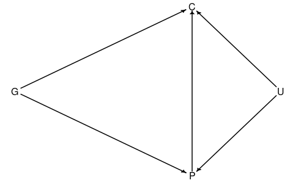

```{r setup, include=FALSE}
knitr::opts_chunk$set(echo = TRUE, message = FALSE, warning = FALSE)
```

Throughout the analysis, we heavily use `rethinking` and `tidymodels` packages. More information can (and must) be found <a href="https://www.tmwr.org/">here</a>, <a href="https://xcelab.net/rm/statistical-rethinking/">here</a> and <a href="https://github.com/rmcelreath/rethinking">here</a>.

# Collider bias

## The family education example

In <a href="https://xcelab.net/rm/statistical-rethinking/">Statistical Rethinking</a>, section 6.3, the <a href="https://github.com/rmcelreath">author</a> analyses the effect of unknown variables within regression models, in the context of a DAG containing a *collider* variable.

In their example, the following system is defined:

<center>



</center>

Here C, P, G stand for the educational achievement of a family's children, their parents' and grandparents'. Also, U is the environment variable, which also influences the education in the system (but not the grandparents' because it was probably long ago, and should be another variable if included).

The *collider* variable, in this case, is P.

### Data

Let us quickly reproduce the data.

```{r}
library(rethinking)
library(tidyverse)

family_set <- function(N = 200, b_GP = 1, b_GC = 0, b_PC = 1, b_U = 2, seed = 1){
  
  set.seed(seed)
  U <- 2*rbern(N, 0.5) - 1
  G <- rnorm(N)
  P <- rnorm(N, b_GP*G + b_U*U)
  C <- rnorm(N, b_PC*P + b_GC*G + b_U*U)
  d <- tibble(C = C, P = P, G = G, U = U)
  
  d
}

d <- family_set()
d
```

The book shows that, if we model C with `rethinking::quap`, we see that doing so without includuing `U` will yield a (negative) deceptive value for the influence of G.

```{r}
m6.11 <-
  quap(
    alist(
      C ~ dnorm(mu, sigma),
      mu <- a + b_PC * P + b_GC * G,
      a ~ dnorm(0, 1),
      c(b_PC, b_GC) ~ dnorm(0, 1),
      sigma ~ dexp(1)
    )
    ,data = d
  )
precis(m6.11)
```

If two parents have the same education level, but their respective parents (the grandparents in the system) have different education levels, that must mean that the environment is **worse** for the family with the better grandparent. Hence, the child will have worse education level in comparison to the other family's child, once G did not influence C in the data construction. The model, not knowing of U, will think that less G means better C in that particular situation.

Now, let us see if that has any effects in accuracy, using the same example.

### The effect of colliders in the accuracy

First, we'll need a larger set, and we'll split into training and testing.

```{r}
library(tidymodels)
tidymodels_prefer()

family_data <- list()
family_data$set <- family_set(N = 4000)

set.seed(100)
family_data$split <- initial_split(family_data$set, prop = 0.80)
family_data$train <- training(family_data$split)
family_data$test <-  testing(family_data$split)
```

For each method, we'll train two models: with and without using the variable U.

Thanks to `tidymodels`, we can create recipes (removing or adding U for example), and compare multiple methods.

It is advised to standardize the variables for regression models.

We will use cross-validation and some hyperparameter tuning.

```{r}
set.seed(100)
family_data$folds <- vfold_cv(family_data$train, v = 10)
family_data$folds
```

```{r}
# Standardize the data for regression models
family_data$recipes$lm$wo_U <-
  recipe(C ~ G + P, data = family_data$train) %>%
  step_mutate_at(all_predictors(), fn = \(x) x %>% scale() %>% .[,1])

family_data$recipes$lm$w_U <-
  recipe(C ~ G + P + U, data = family_data$train) %>%
  step_mutate_at(all_predictors(), fn = \(x) x %>% scale() %>% .[,1])

family_data$wf_sets$lm <-
  workflow_set(
    preproc = family_data$recipes$lm
    , models =
      list(
        lm = linear_reg() %>% set_engine("stan")
        ,xgb =
          boost_tree(
            trees = tune(), min_n = tune(), tree_depth = tune(), learn_rate = tune(), 
            loss_reduction = tune(), sample_size = tune()
          ) %>% set_mode("regression") %>%set_engine("xgboost")
      )
    # , cross = FALSE
  )
```

We define a basic race control:

```{r}
race_ctrl <-
  finetune::control_race(
    save_pred = TRUE,
    parallel_over = "everything",
    save_workflow = TRUE
  )
```

Now we're allowed to train everything altogether.

```{r}
family_data$results_final <-
  family_data$wf_sets$lm %>%
  workflow_map(seed = 100,
               resamples = family_data$folds,
               grid = 5,
               control = race_ctrl,
               verbose = TRUE,
               metrics = metric_set(rmse, rsq)
  )
```

Comparing each method across the folds:

```{r}
library(ggrepel)
autoplot(
  family_data$results_final,
  rank_metric = "rsq",
  metric = "rsq",
  select_best = TRUE
)
```

```{r}
autoplot(
  family_data$results_final,
  rank_metric = "rsq",
  metric = "rsq",
  select_best = TRUE
)
```

We should also plot each set of predictions in the test set. For each workflow, let us extract the best parameters and get the result in the test set.

```{r}
get_last_fit_df <- function(wflow_id, models_table, split_obj){
  models_table %>% 
    extract_workflow(wflow_id) %>% 
    finalize_workflow(
      models_table %>% 
        extract_workflow_set_result(wflow_id) %>% 
        select_best(metric = "rsq")
    ) %>%
    last_fit(split = split_obj, metrics = yardstick::metric_set(rmse, rsq, mae))
}

get_last_fit_results <-
  function(wflow_id, models_table, split_obj){
    get_last_fit_df(wflow_id, models_table, split_obj) %>%
      .$.metrics %>%
      .[[1]] %>%
      mutate(wflow_id = wflow_id)
  }

family_data$results <-
  family_data$results_final %>%
  pull(wflow_id) %>%
  purrr::map_dfr(\(x) get_last_fit_results(wflow_id = x,
                                           models_table = family_data$results_final,
                                           split_obj = family_data$split))

ggplot(data = family_data$results, aes(x = .metric, y = .estimate, colour = wflow_id, group = wflow_id)) +
  geom_line()
```

The valuable U has indeed helped witht he accuracy. This is, however, expected, since we're giving more relevant information to the model. The next eexample should be a more interesting experiment.

## The happiness example

Does age cause an effect in a person's happiness?

This is a case where, including the marriage status yields misleading coefficients when analyzing the regression results, which is mainly caused by <a href="https://en.wikipedia.org/wiki/Simpson%27s_paradox">Simpson's Paradox</a>. Does this also harm the accuracy?

### Data

Let us quickly reproduce the data, once more.

```{r}
happiness_data <- list()
happiness_data$set <- rethinking::sim_happiness(seed=100, N_years=1200) %>% as_tibble()

set.seed(100)
happiness_data$split <- initial_split(happiness_data$set, prop = 0.80)
happiness_data$train <- training(happiness_data$split)
happiness_data$test <-  testing(happiness_data$split)
```

### The effect of colliders in the accuracy

```{r}
set.seed(100)
happiness_data$folds <- vfold_cv(happiness_data$train, v = 10)
happiness_data$folds

# Standardize the data for regression models
happiness_data$recipes$lm$wo_married <-
  recipe(happiness ~ age, data = happiness_data$train) %>%
  step_mutate_at(all_predictors(), fn = \(x) x %>% scale() %>% .[,1])

happiness_data$recipes$lm$w_married <-
  recipe(happiness ~ married + age, data = happiness_data$train) %>%
  step_mutate_at(all_predictors(), fn = \(x) x %>% scale() %>% .[,1])

happiness_data$wf_sets$lm <-
  workflow_set(
    preproc = happiness_data$recipes$lm
    , models =
      list(
        lm = linear_reg() %>% set_engine("stan")
        ,xgb =
          boost_tree(
            trees = tune(), min_n = tune(), tree_depth = tune(), learn_rate = tune(), 
            loss_reduction = tune(), sample_size = tune()
          ) %>% set_mode("regression") %>%set_engine("xgboost")
      )
    # , cross = FALSE
  )
```

```{r}
happiness_data$results_final <-
  happiness_data$wf_sets$lm %>%
  workflow_map(seed = 100,
               resamples = happiness_data$folds,
               grid = 5,
               control = race_ctrl,
               verbose = TRUE,
               metrics = metric_set(rmse, rsq)
  )
```

```{r}
autoplot(
  happiness_data$results_final,
  rank_metric = "rsq",
  metric = "rsq",
  select_best = TRUE
) +
  geom_text(aes(y = mean, label = wflow_id), nudge_x = -0.25, angle = 90, hjust = 0.5)
```

```{r}
autoplot(
  happiness_data$results_final,
  rank_metric = "rmse",
  metric = "rmse",
  select_best = TRUE
) +
  geom_text(aes(y = mean, label = wflow_id), nudge_x = -0.25, angle = 90, hjust = 0.5)
```
```{r}
happiness_data$results <-
  happiness_data$results_final %>%
  pull(wflow_id) %>%
  purrr::map_dfr(\(x) get_last_fit_results(wflow_id = x,
                                           models_table = happiness_data$results_final,
                                           split_obj = happiness_data$split))

ggplot(data = happiness_data$results, aes(x = .metric, y = .estimate, colour = wflow_id, group = wflow_id)) +
  geom_line()
```

As you can see, the accuracy is absolutely terrible, but the `married` variable does help. Let us visualize how terrible it is:

```{r}
happiness_data$last_fit_df <-
  happiness_data$results %>%
  filter(.metric == 'rsq') %>%
  slice_max(.estimate, n = 1, with_ties = F) %>%
  pull(wflow_id) %>%
  get_last_fit_df(wflow_id = .,
                  models_table = happiness_data$results_final,
                  split_obj = happiness_data$split) 

happiness_data$pred_test <-
  happiness_data$last_fit_df %>%
  pull(.predictions) %>%
  .[[1]] %>%
  bind_cols(happiness_data$test %>% select(married, age))
   
ggplot(happiness_data$pred_test, aes(x = happiness, y = .pred)) + 
    # Create a diagonal line:
    geom_abline(lty = 2) + 
    geom_point(alpha = 0.5) + 
    coord_obs_pred()
```

It's relevant to check what coefficients we have found for each variable.

```{r}
happiness_data$last_fit_df %>%
    extract_fit_engine()
```

Here, `married` had a positive effect, whilst `age` had a slightly negative effect, just like in Statistical Rethinking, although the author utilizes `married` differently there, in the formula.

As stated there, also, we cannot look at these coefficients and say that the more you age, the less happy you are. This impression is rather caused by the influence of the marriage variable in the model, which induces the <a href="https://en.wikipedia.org/wiki/Simpson%27s_paradox">Simpson's Paradox</a>.
